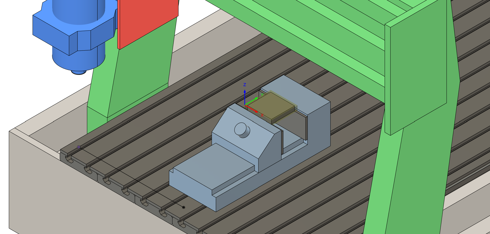
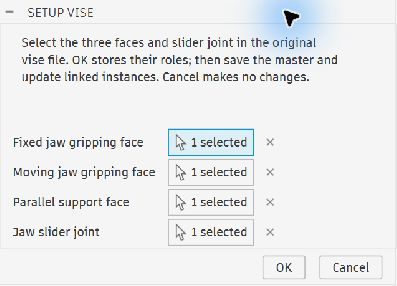
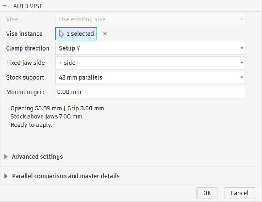

# Fusion Auto Vise



Auto Vise inserts and positions a linked vise around the **CAM stock** in Autodesk Fusion. It sets the jaw opening, calculates grip depth, and optionally creates a pair of parallels. Reopen the same command to adjust an existing fit.

Two commands cover the workflow:

| Command | Workspace | Purpose |
| --- | --- | --- |
| **Setup Vise** | Design, Auto Vise Master panel | Assign the gripping faces, parallel support face, and slider joint once in the original vise file. |
| **Auto Vise** | Manufacture, Auto Vise panel | Insert a configured vise or edit an existing one for the active setup. |

## 1. Install or update

1. Keep the complete `AutoVise` folder together, including `Resources` and `parallels.json`.
2. Open Fusion's **Scripts and Add-Ins** dialog and select the **Add-Ins** tab.
3. Add the `AutoVise` folder if it is not already registered.
4. Select Auto Vise and click **Run**.
5. After updating the files, close any Auto Vise dialog, then **Stop → Run** the add-in to load the changes.

The add-in does not start automatically by default. Enable **Run on Startup** in Fusion if desired.

## 2. Prepare the vise master — once per vise

Open the **original vise design**, not a linked copy inside a machining document.

The supported vise has a stationary jaw, a movable jaw controlled by a slider joint, two opposing planar gripping faces, and a stationary planar seat beneath the parallels. Jaw components must be local to the master file.

1. Switch to **Design**.
2. Open **Setup Vise** in **Design → Utilities → Auto Vise Master**.
3. Assign the following selections:

| Dialog field | What to select |
| --- | --- |
| **Fixed jaw gripping face** | The flat inward-facing surface that contacts the stock on the stationary jaw. |
| **Moving jaw gripping face** | The opposing flat contact surface on the movable jaw. |
| **Parallel support face** | The upward-facing stationary surface on which the bottoms of the parallels rest. |
| **Jaw slider joint** | The existing slider joint that opens and closes the jaws. |

4. Click **OK** to store the assignments.
5. **Save the master file.** Existing linked copies must be updated in their machining documents to receive changes.



*The four assignments are restored when you reopen Setup Vise in a configured master.*

These assignments are stored as attributes on the actual faces and joint. Component names do not determine their roles; renaming a component does not require reconfiguration. No named construction point is needed.

If you deliberately replace or reshape an assigned face, run **Setup Vise** again, save the master, and update the linked copies. Missing, duplicated, or changed selections are rejected instead of guessed.

## 3. Prepare the machining setup

1. Save the machining document to Fusion cloud. The vise master and machining document must be in the **same Fusion project** for the file-selection workflow.
2. Create a Manufacture setup with **Fixed Size Box** or **Relative Size Box** stock.
3. Check the setup's coordinate system and stock allowances.
4. **Activate the intended setup in the Manufacture browser.** Auto Vise uses that setup automatically; there is no Setup dropdown in its dialog.

Use a separate vise instance for each setup. If several setups exist and none is active, Auto Vise asks you to activate one rather than choosing for you.

## 4. Insert and fit a new vise

1. Open **Auto Vise** in Manufacture.
2. Set **Vise** to **Insert new vise**.
3. Click **Choose vise file…** and select your saved, configured master.
4. Choose the clamping direction, fixed-jaw side, and stock support described below.
5. Click **OK**.

Auto Vise inserts a linked instance and fits it in the same command. Master roles and geometric fit are checked during insertion; invalid selections or dimensions cause the command to fail. **Cancel** does not insert a vise.

For a new insertion, detailed fit measurements are evaluated when you apply. Once inserted, the existing-vise dialog can evaluate them before applying.

## 5. Choose the fit

| Setting | Meaning |
| --- | --- |
| **Clamp direction** | **Setup X** or **Setup Y** selects which stock dimension determines jaw opening. These are setup axes, not screen directions. |
| **Fixed jaw side** | **+ side** places the fixed jaw at the positive stock boundary along the clamping axis; **− side** uses the negative boundary. |
| **Stock support** | Choose a parallel height, or **Manual grip depth** to specify how much stock lies below the jaw tops. |
| **Manual grip depth** | Used only in manual mode. No parallel bodies are generated for this mode. |
| **Minimum grip** | Your minimum acceptable engagement. A value of **0** means no additional minimum is specified. |

The fit summary shows the requested opening, grip depth, and stock height above the jaws. For an existing vise, changing settings updates the summary; **OK applies the movement**. The grip preview is a highlighted region, not a live animation of the jaws.




### Stock opening versus part width

Auto Vise clamps the **CAM stock, including stock allowances**, not the finished part envelope.

For example:

- Part width along Setup Y: **49.887 mm**
- Stock allowance: **3 mm on each side**
- Required jaw opening: **55.887 mm**

A visible gap between a jaw and the finished part can therefore be correct. Compare the jaw faces with the stock boundary.

### Parallels and grip depth

The included pairs are **100 mm long × 4 mm thick**, with heights of **10, 14, 18, 22, 26, 30, 34, 38, and 42 mm**.

Grip is calculated from the distance between the support seat and jaw tops:

```text
grip depth = jaw height above seat − parallel height
stock above jaws = stock thickness − grip depth
```

With a **45 mm** jaw height above the seat, **42 mm** parallels produce **3 mm** of grip. For **10 mm** thick stock, **7 mm** remains above the jaws.

Open **Parallel comparison and master details** to compare the available heights. A choice is rejected if its geometry is incompatible with the stock, jaw contact area, slider limits, or minimum grip. Geometric validation does not determine clamping force.

The library is stored in [`AutoVise/parallels.json`](AutoVise/parallels.json). Each entry defines a unique name and its height, thickness, and length in millimetres.

## 6. Change an existing fit

1. Activate the setup that owns the vise.
2. Open **Auto Vise** again.
3. Its saved vise and fitting options are restored automatically.
4. Change the direction, side, support, or grip requirement.
5. Review the summary and click **OK**, or **Cancel** to leave the fit unchanged.

To use an existing unconfigured instance, choose **Use existing vise** and select the **top-level vise instance**, not an individual jaw. Its master must already have the four roles assigned.

A setup that already owns a vise edits that instance rather than inserting a duplicate. Repeated parallel fits update the same two bodies, preserving their CAM references. Switching to manual grip hides the owned parallel component and removes it from this setup's fixtures; choosing parallels again reuses it.

Updating existing parallel bodies requires a **parametric design** with their original two-body base feature intact. Avoid deleting or restructuring that generated feature.

## 7. Advanced settings

### CAM fixtures and preview

- **Include in CAM fixtures** adds the vise and selected parallels to the setup's fixtures. Existing vise fixture membership is retained on subsequent fits; clearing this option does not remove a vise already included in the setup.
- **Show grip preview** displays the grip region while editing an existing vise.
- **CAM origin units** defaults to **mm**, as used by the tested Fusion host. This concerns CAM coordinate translation, not the units displayed in the document. Change it only when resolving a confirmed coordinate-unit mismatch.

### Optional Part Position offsets

Normal fitting does not require machine attachment configuration and leaves existing Part Position offsets unchanged.

To change those offsets through Auto Vise:

1. Configure Fusion's **Table Attach Point**.
2. When using a fixture-point reference, select a stable explicit point on the vise base rather than relying on a changing fixture bounding box.
3. Expand **Advanced settings** and enable **Change Part Position offsets**.
4. Enter the X, Y, and Z offsets from the selected Fusion reference.

These values are offsets, not absolute machine coordinates. The option resets when you reopen Auto Vise so that offsets are not written again unintentionally. Check the final arrangement in machine simulation, particularly when fixture geometry determines the Part Position reference.

## Troubleshooting

| Symptom | What to check |
| --- | --- |
| **OK is greyed out** | Read the message directly below the fit settings. Choose a master file in insert mode, or a top-level vise in existing mode. Resolve the specific reported fit or selection error. |
| **Missing or changed master roles** | Open the original vise, run Setup Vise, save it, then update the linked instance. Renaming a face or joint does not assign its role. |
| **Vise belongs to another setup** | Activate its owning setup to edit it, or insert a separate vise for the other setup. |
| **Jaws seem too far apart** | Compare against CAM stock, including allowances. The finished part can be narrower than the correct opening. |
| **Changing the dialog does not move the jaws** | The summary evaluates the proposed fit. Apply it with OK. |
| **A parallel height is rejected** | Check minimum grip, stock thickness, jaw height, slider travel, and whether the contact band crosses a notch or chamfer. |
| **Part Position reference error** | If changing offsets, configure Table Attach Point and the explicit fixture reference in Fusion. Leave the option off for ordinary fitting. |
| **Buttons do nothing or an old dialog appears** | Close the command and Stop → Run Auto Vise in Scripts and Add-Ins. |
| **Saved geometry is missing or edited** | Restore the referenced vise/parallel feature, or correct the master assignments as indicated by the error. |

For diagnostics, the add-in writes:

- `AutoVise/last_run.json`: measurements, placement, timings, and errors from the latest fit.
- `AutoVise/bootstrap_debug.txt`: add-in loading status and errors.

## Validation and development notes

The current automated suite contains **39 passing tests**. Live checks have covered linked master-role resolution, jaw opening, repeated fitting, direction changes, parallel updates, and recomputation. The user has also reported testing the workflow. See [`tests/VERIFICATION.md`](tests/VERIFICATION.md) for the detailed engineering record, including checks recorded as pending at the time.

The active entry point is `AutoVise/AutoVise.py`. Historical implementations have been removed from the current tree and remain available in Git history. Their construction-point and component-name requirements do not apply to this workflow.

Run the local tests with `python -m unittest discover -s tests`. Build a clean installable ZIP with `python tools/build_release.py`; the output is written to `dist/`. See [publishing notes](docs/PUBLISHING.md) for the repository and release layout.
